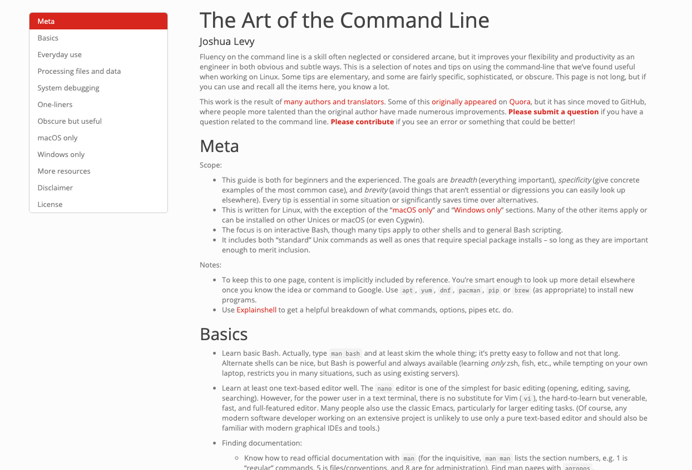

the `taotcl.R` script provides a means to render [The Art of the Command Line](https://github.com/jlevy/the-art-of-command-line) into a standalone HTML document (which will look like this):



It supports all languages in the TAotCL repo and you have the option of changing the document and highlight themes.

```
usage: ./taotcl.R [--help] [--just-render] [--opts OPTS] [--language LANGUAGE] [--theme THEME] [--highlight HIGHLIGHT] [--output-dir OUTPUT-DIR]

or (on Windows): Rscript taotcl.R [--help] [--just-render] [--opts OPTS] [--language LANGUAGE] [--theme THEME] [--highlight HIGHLIGHT] [--output-dir OUTPUT-DIR]

Render 'The Art of the Command Line' to HTML


flags:
  -h, --help                    show this help message and exit
  -j, --just-render             Only render the document. Do not open in the system default browser. 
                                (Default is to render and open.)

optional arguments:
  -x, --opts OPTS               RDS file containing argument values
  -l, --language LANGUAGE       Language to render. Leave unspecified for English. 
                                Current known: "cs", "de", "el", "es", "fr", "id", "it", "ja", 
                                "ko", "pt", "ro", "ru", "sl", "uk", "zh-Hant", "zh" [default: ]
  -t, --theme THEME             Which R Markdown document theme to use. Ref: https://l.rud.is/2JOibrZ [default: simplex]
  -c, --highlight HIGHLIGHT	    Which R Markdown code higlight theme to use. Ref: https://l.rud.is/2JOibrZ [default: espresso]
  -o, --output-dir OUTPUT-DIR   Where to store the rendered file. Defaults to current working directory. 
                                [default: /Users/hrbrmstr/Development/taotcl]
```